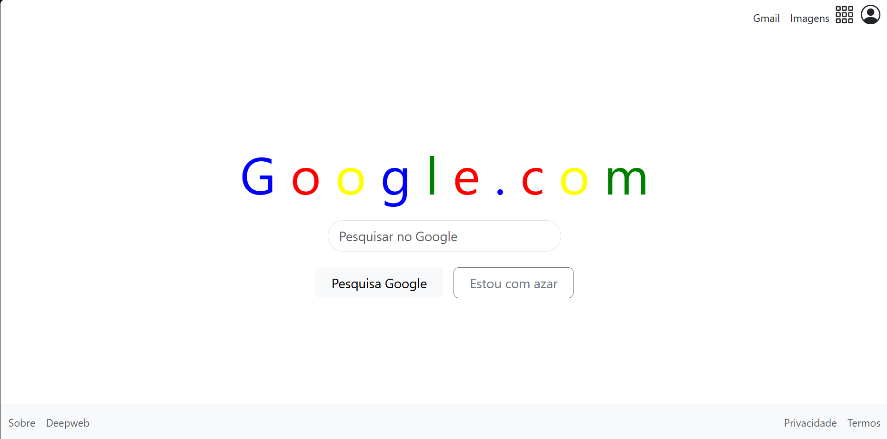

# Google - Recriação com Bootstrap

## 📌 Versão do Bootstrap
- **Bootstrap 5.3.2** via CDN

## ⚙️ Decisões principais
- **Navbar responsiva** com `navbar-toggler` para versão mobile.  
- **Grid do Bootstrap** para centralizar o campo de busca e manter responsividade (`col-12 col-md-6 col-lg-4`).  
- **Botões responsivos** organizados com `flex-column flex-sm-row`.  
- **Footer dividido em duas colunas** com alinhamento dinâmico (coluna única no mobile e alinhamento à direita no desktop).  
- **Formulário funcionalmente desativado** para simular a busca sem recarregar a página.  
- **Uso de utilitários Bootstrap** como `d-flex`, `rounded-pill`, `gap-3`, `text-muted` e `min-vh-100` para layout e estilização.  

## 📱💻 Prints
### Versão Mobile

### Versão Desktop

